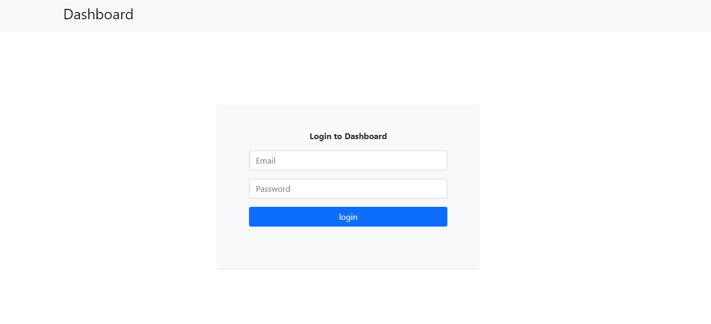

# AdminComp Docs Dashboard

## Motivation

This project is for admins of [AdminComp Docs Site](https://zen-ptolemy-6bcc40.netlify.app/). This is to enable them edit parts of the site in real time without touching a single line of code.

## Screenshot

## URL

[AdminComp Docs Dashboard](https://goofy-turing-ea6310.netlify.app/)

## Installation

Clone Repo

## Tech/framework used

1. HTML5
2. CSS3
3. Bootstrap 5
4. Netlify
5. Firebase (Firestore and Authentication)
6. JavaScript

## Contributing

Pull requests are welcome. For major changes, please open an issue first to discuss what you would like to change.
